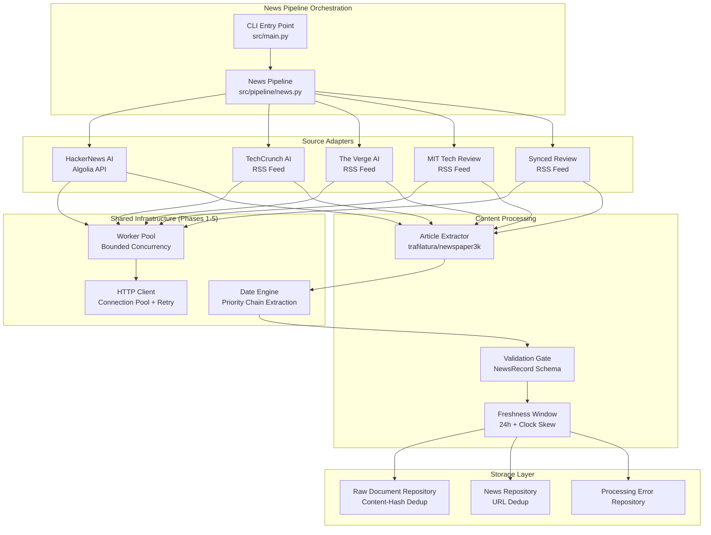
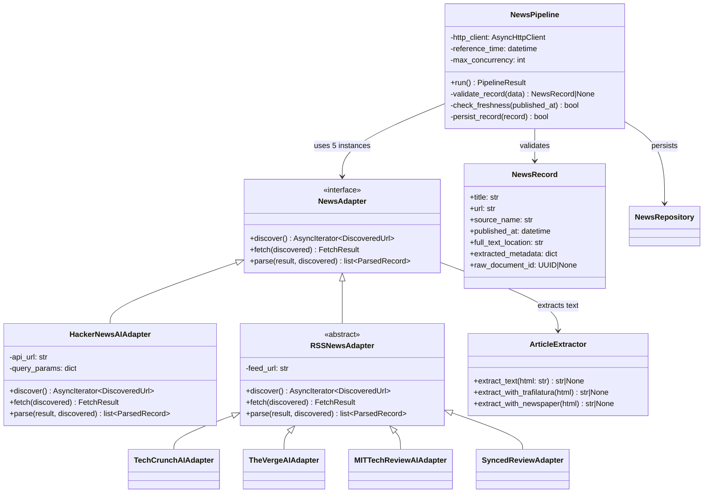
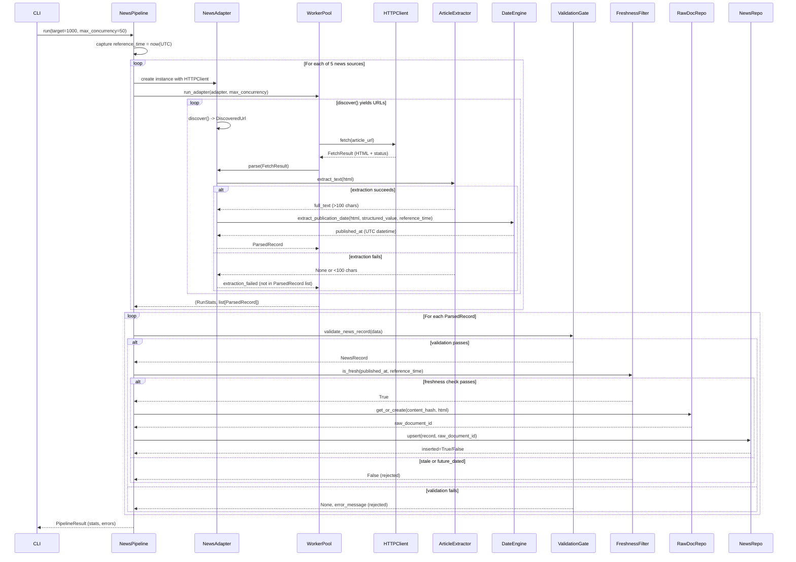

# Design Document: Phase 6 - High-Fidelity AI News Ingestion

## Overview

### Purpose

The News vertical extends the GraphOne Intelligence Pipeline (Phases 1-5) to ingest high-fidelity AI-related news articles from five distinct reputable sources. The system provides complete article text, accurate publication dates, and strict 24-hour freshness guarantees while maintaining full anti-hallucination compliance.

### Key Design Principles

1. **Reuse Over Reinvention**: Leverage existing infrastructure (HTTP_Client, Date_Engine, Worker_Pool, Raw_Document_Repository) rather than creating parallel systems
2. **Explicit Rejection Over Fabrication**: Reject incomplete records rather than inventing missing data
3. **Database-Level Deduplication**: Enforce uniqueness constraints at the schema level, not just in application code
4. **Observable Failure Modes**: Track distinct rejection categories (extraction_failed, stale, future_dated, invalid, blocked) for operational visibility
5. **Testability Without Network**: All components designed for testing with mocked fixtures, no live dependencies in default test suite

### Success Criteria

- Ingest from exactly 5 verified AI news sources (HackerNews, TechCrunch, The Verge, MIT Tech Review, Synced Review)
- Extract full article text (minimum 100 characters) for every valid record
- Enforce strict 24-hour freshness with configurable clock skew tolerance
- Deduplicate by (source_name, url) and content_hash
- Preserve complete provenance for all fetched articles
- Achieve zero fabrication: missing data → rejection, never invention
- Minimum 40 new tests with mocked fixtures (no live network dependencies)


## Architecture

### High-Level System Architecture



### Integration with Existing Infrastructure

#### HTTP Client Reuse (src/crawlers/http.py)

The News vertical uses the shared `AsyncHttpClient` instance for all network operations:

- **Connection Pooling**: Single client instance with pool size = max_concurrency × 2
- **Bounded Concurrency**: asyncio.Semaphore enforces MAX_CONCURRENCY across all adapters
- **Retry Logic**: Exponential backoff with jitter for transient failures (429, 5xx)
- **Typed Error Translation**: NetworkError, RateLimitError, BlockedSourceError, TimeoutErrorPipeline
- **Rate Limit Handling**: Honors Retry-After header, detects X-RateLimit-Remaining: 0

**Key Design Decision**: All news adapters receive the same HTTP client instance, ensuring global concurrency limits and connection reuse.

#### Date Engine Reuse (src/extraction/dates.py)

The existing Date_Engine implements a deterministic priority chain:

1. **Structured Value** (RSS pubDate, API timestamp) → highest priority
2. **JSON-LD** datePublished/dateCreated
3. **OpenGraph/Meta Tags** (article:published_time, og:updated_time)
4. **Time Tags** `<time datetime="...">`
5. **Visible Text** (absolute dates, then relative dates like "2 hours ago")

**Integration Strategy**:
- RSS adapters pass `pubDate` as `structured_value` parameter
- HackerNews adapter passes `created_at` as `structured_value`
- Article HTML fallback uses JSON-LD → meta → time tag → visible text chain
- All dates normalized to UTC via `to_utc()`
- `reference_time` passed explicitly for deterministic relative date parsing


#### Worker Pool Reuse (src/pipeline/workers.py)

The existing Worker_Pool provides:

- **Bounded Concurrency**: asyncio.Semaphore limits concurrent fetch/parse operations
- **In-Run URL Dedup**: `seen_urls` set with `normalize_url()` prevents redundant fetches within a single run
- **Graceful Failure Handling**: BlockedSourceError, PayloadTooLargeError caught and logged
- **RunStats Aggregation**: discovered, fetched, fetch_failed, parsed_records, skipped_duplicate, blocked

**Integration Strategy**:
- News pipeline calls `run_adapter(adapter, max_concurrency=MAX_CONCURRENCY, max_items=per_adapter_target)`
- Each news source adapter returns `(RunStats, list[ParsedRecord])`
- Pipeline aggregates stats across all 5 sources
- Worker pool handles transient failures, continues processing remaining URLs

#### Storage Pattern Reuse

**Raw_Document_Repository** (src/storage/repositories.py):
- Content-hash deduplication via SHA-256 on raw HTML
- Unique constraint: `uq_raw_documents_content_hash`
- `INSERT ... ON CONFLICT (content_hash) DO UPDATE SET retrieved_at = EXCLUDED.retrieved_at`
- Returns existing row if content-hash collision (idempotent)

**News_Repository** (src/storage/repositories.py):
- URL-based deduplication via (source_name, url) unique constraint
- Unique constraint: `uq_news_source_url`
- `INSERT ... ON CONFLICT (source_name, url) DO NOTHING`
- Returns True if new row inserted, False if duplicate

**ProcessingError_Repository**:
- Tracks all rejected records with rejection_reason
- Categories: validation_error, extraction_failed, stale_record, future_dated, blocked_source


### Component Diagram




### Data Flow Diagram




## Components and Interfaces

### News Source Adapters

#### 1. HackerNewsAIAdapter

**Purpose**: Discover AI-related stories from HackerNews via Algolia API

**Configuration**:
```python
BASE_URL = "https://hn.algolia.com/api/v1/search_by_date"
QUERY_PARAMS = {
    "tags": "story",
    "query": '"artificial intelligence" OR "machine learning" OR "deep learning" OR "neural network" OR "LLM" OR "GPT"',
    "hitsPerPage": 50,
}
```

**Discovery Flow**:
1. Query Algolia API with AI-related search terms
2. Parse JSON response for `hits` array
3. Extract `objectID`, `title`, `url` (article destination, not HN comments), `created_at`
4. Yield `DiscoveredUrl(url=article_url, metadata={hn_story_id, hn_title, hn_created_at})`

**Fetch Flow**:
1. Fetch destination article URL (not HN comments page)
2. Return `FetchResult` with article HTML

**Parse Flow**:
1. Extract full text from article HTML using `ArticleExtractor`
2. Use HN story `created_at` as `structured_value` for date extraction (highest priority)
3. Fallback to Date_Engine for article page if needed
4. Construct `ParsedRecord` with `record_type="NEWS"`

**Key Design Decision**: Use HN submission timestamp as publication date, not destination article's date, since freshness is measured against HN submission time.


#### 2-5. RSS News Adapters (TechCrunch, The Verge, MIT Tech Review, Synced Review)

**Base Class**: `RSSNewsAdapter(SourceAdapter)`

**Configuration**:
```python
RSS_FEED_URLS = {
    "techcrunch_ai_rss": "https://techcrunch.com/category/artificial-intelligence/feed/",
    "theverge_ai_rss": "https://www.theverge.com/rss/ai-artificial-intelligence/index.xml",
    "mit_technology_review_ai_rss": "https://www.technologyreview.com/topic/artificial-intelligence/feed",
    "synced_review_rss": "https://syncedreview.com/feed/",
}
```

**Discovery Flow**:
1. Fetch RSS feed XML using `HTTPClient`
2. Parse XML using `feedparser` or `xml.etree.ElementTree`
3. Extract for each item:
   - `<title>`: article title
   - `<link>`: article URL
   - `<pubDate>`: publication date (RFC 822 format)
   - `<description>`: article excerpt (optional)
4. Yield `DiscoveredUrl(url=link, metadata={rss_title, rss_pubDate, rss_description})`

**Fetch Flow**:
1. Fetch article URL using `HTTPClient`
2. Return `FetchResult` with article HTML

**Parse Flow**:
1. Extract full text from article HTML using `ArticleExtractor`
2. Pass RSS `pubDate` as `structured_value` to Date_Engine (highest priority)
3. Fallback to Date_Engine HTML extraction if RSS pubDate is missing/invalid
4. Construct `ParsedRecord` with `record_type="NEWS"`

**RSS Parsing Strategy**:
```python
import feedparser

def parse_rss_feed(xml_text: str) -> list[dict]:
    feed = feedparser.parse(xml_text)
    items = []
    for entry in feed.entries:
        items.append({
            "title": entry.get("title"),
            "url": entry.get("link"),
            "pubDate": entry.get("published"),  # RFC 822 format
            "description": entry.get("description"),
        })
    return items
```

**Date Normalization**:
```python
from dateutil import parser as dateutil_parser

def normalize_rss_date(rfc822_date: str) -> datetime | None:
    try:
        dt = dateutil_parser.parse(rfc822_date)
        return to_utc(dt)
    except (ValueError, TypeError):
        return None
```


### Article Extractor Component

**Purpose**: Extract main article content from HTML, excluding navigation/ads/boilerplate

**Primary Library**: trafilatura (fallback to newspaper3k if needed)

**Interface**:
```python
class ArticleExtractor:
    @staticmethod
    def extract_text(html: str, source_url: str) -> str | None:
        """Extract article text, return None if extraction fails or <100 chars."""
        pass
```

**Implementation Strategy**:

```python
import trafilatura
from newspaper import Article

class ArticleExtractor:
    MIN_CONTENT_LENGTH = 100
    MAX_CONTENT_LENGTH = 100_000
    
    @staticmethod
    def extract_text(html: str, source_url: str) -> str | None:
        # Try trafilatura first (more accurate, preserves structure)
        try:
            text = trafilatura.extract(
                html,
                include_comments=False,
                include_tables=False,
                no_fallback=False,
            )
            if text and len(text.strip()) >= ArticleExtractor.MIN_CONTENT_LENGTH:
                return text[:ArticleExtractor.MAX_CONTENT_LENGTH]
        except Exception:
            pass
        
        # Fallback to newspaper3k
        try:
            article = Article(source_url)
            article.set_html(html)
            article.parse()
            text = article.text
            if text and len(text.strip()) >= ArticleExtractor.MIN_CONTENT_LENGTH:
                return text[:ArticleExtractor.MAX_CONTENT_LENGTH]
        except Exception:
            pass
        
        return None
```

**Extraction Failure Handling**:
1. If `extract_text()` returns `None` or text < 100 chars → extraction_failed
2. Log: `extraction_failed` with url, bytes_fetched, library_used, reason
3. Preserve raw HTML in `Raw_Document_Repository` with `extraction_status="extraction_failed"`
4. Set `extracted_metadata["extraction_failed"] = True`
5. Do NOT persist to News table (reject record)
6. Increment `stats.extraction_failed` counter

**Truncation Strategy**:
- Truncate extracted text to 100,000 characters max
- Set `extracted_metadata["truncated"] = True` if truncation occurs
- Log warning for truncated articles


### Publication Date Extraction Architecture

**Priority Chain** (via existing Date_Engine):

```
1. structured_value (RSS pubDate, HN created_at) ← HIGHEST PRIORITY
2. JSON-LD datePublished/dateCreated
3. OpenGraph/Meta tags (article:published_time, og:updated_time)
4. <time datetime="..."> tags
5. Visible date text (absolute formats)
6. Relative date expressions ("2 hours ago", reference_time required)
```

**Integration Pattern**:

```python
from src.extraction.dates import extract_publication_date, to_utc

def parse_article_date(
    html: str,
    structured_value: str | datetime | None,
    reference_time: datetime,
) -> datetime | None:
    """Extract publication date using Date_Engine priority chain."""
    published_at = extract_publication_date(
        html=html,
        structured_value=structured_value,
        reference_time=reference_time,
        visible_text=None,  # Date_Engine extracts from HTML directly
        source_heuristic=None,
    )
    return to_utc(published_at) if published_at else None
```

**Provenance Tracking**:

Store all attempted extraction strategies in `Raw_Document.publication_date_candidates`:

```python
publication_date_candidates = {
    "rss_pubDate": "2024-01-15T10:30:00Z",
    "json_ld": None,
    "meta_article_published_time": "2024-01-15T10:30:00Z",
    "time_tag": None,
    "visible_text": "January 15, 2024",
    "selected": "rss_pubDate",
}
```

**Missing Date Handling**:
- If all extraction strategies fail → `published_at = None`
- Validation gate rejects record with `validation_error: "published_at is required"`
- Do NOT default to `reference_time` or guess from URL patterns
- Log rejection with all attempted strategies


### Freshness Validation Architecture

**Strict 24-Hour Window with Clock Skew Tolerance**

**Configuration**:
```python
# Environment variables with defaults
FRESHNESS_WINDOW_HOURS = int(os.getenv("FRESHNESS_WINDOW_HOURS", "24"))
CLOCK_SKEW_TOLERANCE_SECONDS = int(os.getenv("CLOCK_SKEW_TOLERANCE_SECONDS", "60"))
MAX_CLOCK_SKEW_TOLERANCE = 300  # 5 minutes hard cap
```

**Algorithm**:

```python
from datetime import datetime, timedelta, timezone

def is_fresh(
    published_at: datetime,
    reference_time: datetime,
    window_hours: int = 24,
    clock_skew_tolerance_seconds: int = 60,
) -> tuple[bool, str | None]:
    """
    Check if article is fresh within window_hours of reference_time.
    
    Returns: (is_fresh: bool, rejection_reason: str | None)
    
    Acceptance criteria:
    - (reference_time - window_hours) <= published_at <= (reference_time + clock_skew_tolerance)
    - Clock skew tolerance handles minor server clock drift for "just published"
    - Articles exceeding tolerance are genuinely future-scheduled
    """
    published_at = to_utc(published_at)
    reference_time = to_utc(reference_time)
    
    oldest_acceptable = reference_time - timedelta(hours=window_hours)
    newest_acceptable = reference_time + timedelta(seconds=clock_skew_tolerance_seconds)
    
    if published_at < oldest_acceptable:
        age_hours = (reference_time - published_at).total_seconds() / 3600
        return False, f"stale_record: published {age_hours:.1f}h before reference_time"
    
    if published_at > newest_acceptable:
        delta_seconds = (published_at - reference_time).total_seconds()
        return False, f"future_dated: published {delta_seconds:.0f}s ahead of reference_time (exceeds {clock_skew_tolerance_seconds}s tolerance)"
    
    return True, None
```

**Rejection Categories**:

1. **Stale Record**: `published_at < (reference_time - 24h)`
   - Logged: `freshness_rejected`, source_url, published_at, age_hours, window_hours
   - Counter: `stats.stale_records`

2. **Future Dated**: `published_at > (reference_time + clock_skew_tolerance)`
   - Logged: `future_date_rejected`, source_url, published_at, delta_seconds, tolerance
   - Counter: `stats.future_dated_records`

**Key Design Decision**: Clock skew tolerance handles minor server clock drift (default 60s) but rejects genuinely future-scheduled articles that exceed tolerance.


### Validation Pipeline Architecture

**Schema Validation Gate**

**Pydantic Schema** (src/validation/schemas.py):

```python
from pydantic import BaseModel, Field, HttpUrl, field_validator
from datetime import datetime

class NewsRecord(BaseModel):
    schema_version: str = "1.0"
    record_type: str = "NEWS"
    
    title: str = Field(min_length=1)
    url: str
    source_name: str = Field(min_length=1)
    published_at: datetime  # UTC, not nullable
    full_text_location: str = Field(min_length=1)
    extracted_metadata: dict = Field(default_factory=dict)
    raw_document_id: uuid.UUID | None = None
    
    @field_validator("url")
    @classmethod
    def _url_must_be_http(cls, v: str) -> str:
        HttpUrl(v)  # Validate shape
        return v
    
    @field_validator("title")
    @classmethod
    def _title_not_blank(cls, v: str) -> str:
        if not v.strip():
            raise ValueError("title must not be blank/whitespace-only")
        return v.strip()
    
    @field_validator("published_at")
    @classmethod
    def _published_at_utc(cls, v: datetime) -> datetime:
        return to_utc(v)

def validate_news_record(data: dict) -> tuple[NewsRecord | None, str | None]:
    """Returns (validated_record, None) on success or (None, error_message) on failure."""
    try:
        return NewsRecord(**data), None
    except Exception as exc:
        return None, str(exc)
```

**Validation Gates** (in order):

1. **Schema Validation**: Required fields present and valid types
2. **Freshness Validation**: 24-hour window with clock skew tolerance
3. **Deduplication Check**: (source_name, url) not already in database
4. **Persistence**: Idempotent upsert to News table


**Pipeline Validation Flow**:

```python
async def process_parsed_records(
    records: list[ParsedRecord],
    reference_time: datetime,
    session: AsyncSession,
) -> PipelineStats:
    stats = PipelineStats()
    news_repo = NewsRepository(session)
    raw_doc_repo = RawDocumentRepository(session)
    error_repo = ProcessingErrorRepository(session)
    
    for record in records:
        # Gate 1: Schema validation
        validated, error = validate_news_record(record.data)
        if validated is None:
            stats.invalid_records += 1
            await error_repo.record(
                source_name=record.source_name,
                url=record.source_url,
                error_category="validation_error",
                message=error,
            )
            logger.warning("validation_failed", url=record.source_url, error=error)
            continue
        
        # Gate 2: Freshness check
        is_fresh_result, rejection_reason = is_fresh(
            validated.published_at,
            reference_time,
            window_hours=FRESHNESS_WINDOW_HOURS,
            clock_skew_tolerance_seconds=CLOCK_SKEW_TOLERANCE_SECONDS,
        )
        if not is_fresh_result:
            if "stale" in rejection_reason:
                stats.stale_records += 1
            else:
                stats.future_dated_records += 1
            logger.warning("freshness_rejected", url=record.source_url, reason=rejection_reason)
            continue
        
        # Provenance: persist raw HTML before structured record
        raw_doc = await raw_doc_repo.get_or_create(
            source_name=record.source_name,
            source_url=record.source_url,
            canonical_url=record.fetch_result.url,
            http_status=record.fetch_result.status_code,
            content_hash=record.fetch_result.content_hash,
            extraction_status="extracted",
            publication_date_candidates=record.data.get("publication_date_candidates", {}),
        )
        
        # Gate 3: Persistence with deduplication
        payload = validated.model_dump(exclude={"schema_version", "record_type"})
        payload["raw_document_id"] = raw_doc.id
        
        inserted = await news_repo.upsert(**payload)
        if inserted:
            stats.persisted += 1
        else:
            stats.duplicate_skipped += 1
    
    return stats
```


### Deduplication Strategy

#### URL-Based Deduplication (News Table)

**Database Constraint**:
```sql
-- From src/storage/models.py News class
CONSTRAINT uq_news_source_url UNIQUE (source_name, url)
```

**Repository Implementation**:
```python
class NewsRepository:
    async def upsert(self, **fields) -> bool:
        """Insert if (source_name, url) hasn't been seen. Returns True if new row."""
        insert_ = _insert_for(self.session)
        stmt = insert_(News).values(**fields).on_conflict_do_nothing(
            index_elements=["source_name", "url"]
        )
        result = await self.session.execute(stmt)
        await self.session.commit()
        return result.rowcount > 0  # True if inserted, False if duplicate
```

**Key Behaviors**:
- Same article URL from different sources → separate rows (per-source dedup)
- Same article URL from same source in concurrent workers → exactly one row persists
- URL normalization via `normalize_url()` before persistence
- No error raised on duplicate, idempotent operation

#### Content-Hash Deduplication (Raw_Document_Repository)

**Database Constraint**:
```sql
-- From src/storage/models.py RawDocument class
CONSTRAINT uq_raw_documents_content_hash UNIQUE (content_hash)
```

**Repository Implementation**:
```python
class RawDocumentRepository:
    async def get_or_create(self, **fields) -> RawDocument:
        """Return existing row if content_hash exists, else insert new."""
        content_hash = fields["content_hash"]
        
        # Check for existing
        existing = await self.session.execute(
            select(RawDocument).where(RawDocument.content_hash == content_hash)
        )
        row = existing.scalar_one_or_none()
        if row is not None:
            return row
        
        # Insert with conflict handling
        insert_ = _insert_for(self.session)
        stmt = (
            insert_(RawDocument)
            .values(**fields)
            .on_conflict_do_nothing(index_elements=["content_hash"])
            .returning(RawDocument.id)
        )
        result = await self.session.execute(stmt)
        await self.session.commit()
        
        new_id = result.scalar_one_or_none()
        if new_id is None:
            # Lost race, fetch winner's row
            existing = await self.session.execute(
                select(RawDocument).where(RawDocument.content_hash == content_hash)
            )
            return existing.scalar_one()
        
        # Fetch newly inserted row
        fetched = await self.session.execute(
            select(RawDocument).where(RawDocument.id == new_id)
        )
        return fetched.scalar_one()
```

**Key Behaviors**:
- Identical HTML from different URLs → single raw_document row
- SHA-256 computed on raw HTML bytes (UTF-8 encoded)
- Multiple News rows can reference same raw_document_id
- Race condition safe: returns winner's row if concurrent insert


## Data Models

### NewsRecord Schema

**Pydantic Model** (src/validation/schemas.py):

```python
class NewsRecord(BaseModel):
    schema_version: str = "1.0"
    record_type: str = "NEWS"
    
    # Required fields (no defaults, must be supplied by adapter)
    title: str = Field(min_length=1)
    url: str  # Validated as HttpUrl shape
    source_name: str = Field(min_length=1)
    published_at: datetime  # UTC-normalized, not nullable
    full_text_location: str = Field(min_length=1)
    
    # Optional fields
    extracted_metadata: dict = Field(default_factory=dict)
    raw_document_id: uuid.UUID | None = None
```

**Database Model** (src/storage/models.py - existing News table):

```python
class News(Base):
    __tablename__ = "news"
    
    id: Mapped[uuid.UUID] = uuid_pk()
    title: Mapped[str] = mapped_column(Text, nullable=False)
    url: Mapped[str] = mapped_column(Text, nullable=False)
    source_name: Mapped[str] = mapped_column(String(120), nullable=False)
    published_at: Mapped[datetime] = mapped_column(DateTime(timezone=True), nullable=False)
    full_text_location: Mapped[str | None] = mapped_column(Text, nullable=True)
    extracted_metadata: Mapped[dict] = mapped_column(PortableJSONB(), default=dict)
    raw_document_id: Mapped[uuid.UUID | None] = mapped_column(ForeignKey("raw_documents.id"), nullable=True)
    collected_at: Mapped[datetime] = mapped_column(DateTime(timezone=True), default=utcnow)
    
    __table_args__ = (UniqueConstraint("source_name", "url", name="uq_news_source_url"),)
```

**Field Descriptions**:

- `title`: Article headline (trimmed, non-empty)
- `url`: Canonical article URL (normalized before persistence)
- `source_name`: Adapter name (e.g., "techcrunch_ai_rss", "hackernews_ai")
- `published_at`: Publication timestamp (UTC, timezone-aware)
- `full_text_location`: Storage location identifier (Phase 6: "inline:extracted_metadata.full_text")
- `extracted_metadata`: JSONB containing:
  - `full_text`: Extracted article body (inline storage for Phase 6)
  - `truncated`: Boolean, true if text exceeded 100KB
  - `extraction_library`: "trafilatura" or "newspaper3k"
  - `extraction_failed`: Boolean (only for provenance, not persisted to News)
- `raw_document_id`: Foreign key to raw_documents.id for provenance
- `collected_at`: Pipeline execution timestamp (reference_time)


### RawDocument Model (Provenance)

**Database Model** (existing, src/storage/models.py):

```python
class RawDocument(Base):
    __tablename__ = "raw_documents"
    
    id: Mapped[uuid.UUID] = uuid_pk()
    source_name: Mapped[str] = mapped_column(String(120), nullable=False)
    source_url: Mapped[str] = mapped_column(Text, nullable=False)
    canonical_url: Mapped[str] = mapped_column(Text, nullable=False)
    retrieved_at: Mapped[datetime] = mapped_column(DateTime(timezone=True), default=utcnow)
    http_status: Mapped[int | None] = mapped_column(Integer, nullable=True)
    content_hash: Mapped[str] = mapped_column(String(64), nullable=False)  # sha256 hex
    raw_content_location: Mapped[str | None] = mapped_column(Text, nullable=True)
    extraction_status: Mapped[str] = mapped_column(String(20), default="pending")
    publication_date_candidates: Mapped[dict] = mapped_column(PortableJSONB(), default=dict)
    crawl_run_id: Mapped[uuid.UUID | None] = mapped_column(ForeignKey("crawl_runs.id"), nullable=True)
    
    __table_args__ = (
        UniqueConstraint("content_hash", name="uq_raw_documents_content_hash"),
        Index("ix_raw_documents_canonical_url", "canonical_url"),
    )
```

**Field Usage for News**:

- `source_name`: Adapter name
- `source_url`: Original article URL from discovery
- `canonical_url`: Final URL after redirects (from FetchResult)
- `http_status`: HTTP status code (200, 301, etc.)
- `content_hash`: SHA-256 hex of raw HTML
- `raw_content_location`: `null` for Phase 6 (S3/MinIO deferred to Phase 9+)
- `extraction_status`: "extracted" or "extraction_failed"
- `publication_date_candidates`: JSONB tracking all date extraction attempts:
  ```json
  {
    "rss_pubDate": "2024-01-15T10:30:00Z",
    "json_ld": null,
    "meta_article_published_time": "2024-01-15T10:30:00Z",
    "time_tag": null,
    "visible_text": "January 15, 2024",
    "selected": "rss_pubDate"
  }
  ```

**Extraction Failure Provenance**:

When full-text extraction fails:
1. Raw HTML still persisted to `raw_documents` with `extraction_status="extraction_failed"`
2. `publication_date_candidates` populated with all date extraction attempts
3. Record NOT persisted to `news` table (rejection)
4. Linkage broken: no `News` row references this `raw_document_id`


### Full-Text Storage Strategy

**Phase 6 Implementation** (Inline JSONB Storage):

```python
# In adapter parse() method after successful extraction
extracted_text = ArticleExtractor.extract_text(html, source_url)
if extracted_text is None or len(extracted_text.strip()) < 100:
    # Extraction failed - reject record
    logger.warning("extraction_failed", url=source_url, reason="no_content_or_too_short")
    return []  # Empty list, no ParsedRecord

# Success - store inline
data = {
    "title": title,
    "url": url,
    "source_name": self.name,
    "published_at": published_at,
    "full_text_location": "inline:extracted_metadata.full_text",
    "extracted_metadata": {
        "full_text": extracted_text[:100_000],  # Truncate to 100KB
        "truncated": len(extracted_text) > 100_000,
        "extraction_library": "trafilatura",
        "extraction_timestamp": datetime.now(timezone.utc).isoformat(),
    },
}
```

**Retrieval Pattern**:

```python
def get_article_text(news_record: News) -> str | None:
    """Retrieve full article text from storage location."""
    if news_record.full_text_location == "inline:extracted_metadata.full_text":
        return news_record.extracted_metadata.get("full_text")
    elif news_record.full_text_location.startswith("s3://"):
        # Phase 9+ S3/MinIO retrieval (not implemented yet)
        raise NotImplementedError("S3 retrieval not yet implemented")
    else:
        return None
```

**Migration Path to S3/MinIO** (Phase 9+):

1. Add S3 client to pipeline
2. Upload extracted text to S3 bucket with key: `articles/{content_hash[:2]}/{content_hash}.txt`
3. Set `full_text_location = f"s3://{bucket}/articles/{content_hash[:2]}/{content_hash}.txt"`
4. Remove `full_text` from `extracted_metadata` JSONB
5. No schema changes required (full_text_location already supports arbitrary URIs)

**Storage Considerations**:

- **Inline Storage** (Phase 6): Simple, no external dependencies, works in sandbox
- **Advantages**: Fast retrieval, no network latency, transactional with metadata
- **Disadvantages**: Increases database size, 100KB limit per article
- **S3/MinIO** (Phase 9+): Scalable, supports unlimited article size, reduces database load
- **Trade-off**: Network latency, eventual consistency, requires object storage infrastructure


## Error Handling

### Failure Categories and Responses

#### 1. Network Failures

**Transient Failures** (Retried):
- `TimeoutErrorPipeline`: HTTP request timeout
- `NetworkError`: Connection reset, DNS failure, 5xx server errors
- `RateLimitError`: 429 Too Many Requests, 403 with X-RateLimit-Remaining: 0

**Handling**:
```python
# In HTTPClient.get() via retry_async
await retry_async(
    _do_request,
    max_attempts=self._max_retries,  # Default: 3
    base_delay=self._base_delay,  # Default: 1.0s
    max_delay=self._max_delay,  # Default: 60s
    retryable_exceptions=(RateLimitError, NetworkError, TimeoutErrorPipeline),
)
```

**Permanent Failures** (Not Retried):
- `BlockedSourceError`: 403 without rate limit headers, 401 Unauthorized
- `PayloadTooLargeError`: 413 Request Entity Too Large

**Handling**:
```python
except BlockedSourceError as exc:
    stats.blocked += 1
    logger.warning("source_blocked", source=adapter.name, url=url, error=str(exc))
    # Continue processing other URLs, do not retry
```


#### 2. Extraction Failures

**Full-Text Extraction Failed**:
- Trafilatura returns `None` or empty string
- Newspaper3k fallback also fails
- Extracted text < 100 characters

**Handling**:
```python
extracted_text = ArticleExtractor.extract_text(html, source_url)
if extracted_text is None or len(extracted_text.strip()) < 100:
    # Log failure
    logger.warning(
        "extraction_failed",
        url=source_url,
        bytes_fetched=len(html),
        extraction_library="trafilatura+newspaper3k",
        reason="no_content_or_too_short",
    )
    
    # Preserve provenance in raw_documents
    await raw_doc_repo.get_or_create(
        source_name=adapter.name,
        source_url=source_url,
        canonical_url=fetch_result.url,
        http_status=fetch_result.status_code,
        content_hash=fetch_result.content_hash,
        extraction_status="extraction_failed",
        publication_date_candidates={},
    )
    
    # Reject record (do not persist to News table)
    stats.extraction_failed += 1
    return []  # Empty ParsedRecord list
```

**Date Extraction Failed**:
- All Date_Engine strategies return `None`
- `published_at = None` passed to validation

**Handling**:
```python
validated, error = validate_news_record(data)
if validated is None:
    # Validation fails due to missing published_at
    stats.invalid_records += 1
    await error_repo.record(
        source_name=adapter.name,
        url=source_url,
        error_category="validation_error",
        message=f"published_at is required: {error}",
    )
    logger.warning("validation_failed", url=source_url, error=error)
    continue  # Reject record
```


#### 3. Validation Failures

**Schema Validation Failed**:
- Missing required field (title, url, source_name, published_at, full_text_location)
- Invalid field type (url not HttpUrl shape, published_at not datetime)
- Constraint violation (title whitespace-only, url malformed)

**Handling**:
```python
validated, error = validate_news_record(data)
if validated is None:
    stats.invalid_records += 1
    await error_repo.record(
        source_name=record.source_name,
        url=record.source_url,
        error_category="validation_error",
        message=error,
        context={"record_type": "NEWS", "validation_error": error},
    )
    logger.warning("validation_failed", url=record.source_url, error=error)
    continue  # Reject record
```

**Freshness Validation Failed**:
- Stale: `published_at < (reference_time - 24h)`
- Future-dated: `published_at > (reference_time + clock_skew_tolerance)`

**Handling**:
```python
is_fresh_result, rejection_reason = is_fresh(published_at, reference_time)
if not is_fresh_result:
    if "stale" in rejection_reason:
        stats.stale_records += 1
        logger.warning("freshness_rejected", url=url, reason=rejection_reason, category="stale")
    else:
        stats.future_dated_records += 1
        logger.warning("freshness_rejected", url=url, reason=rejection_reason, category="future_dated")
    continue  # Reject record
```


#### 4. Persistence Failures

**Database Constraint Violation** (Duplicate):
- Idempotent upsert via `ON CONFLICT DO NOTHING`
- No error raised, returns `inserted=False`

**Handling**:
```python
inserted = await news_repo.upsert(**payload)
if inserted:
    stats.persisted += 1
else:
    stats.duplicate_skipped += 1
    # No log, normal deduplication behavior
```

**Database Connection Failure**:
- Session commit fails, transaction rolled back
- Caught as generic exception, logged to ProcessingError

**Handling**:
```python
try:
    inserted = await news_repo.upsert(**payload)
except Exception as exc:
    stats.rejected += 1
    await error_repo.record(
        source_name=record.source_name,
        url=record.source_url,
        error_category="persistence_error",
        message=str(exc),
        context={"error_type": type(exc).__name__},
    )
    logger.error("persistence_failed", url=record.source_url, error=str(exc))
    continue  # Continue processing other records
```

### Error Recovery Strategies

**Graceful Degradation**:
- Single source blocked → continue with remaining 4 sources
- Single article extraction fails → continue with remaining articles
- Database temporarily unavailable → log errors, continue until reconnection

**No Fabrication**:
- Missing data → reject record, log rejection
- Failed extraction → preserve provenance, reject from News table
- Invalid date → reject record, do not default to `now()`

**Observable Failure Modes**:
- Distinct counters for each failure type
- Structured logging for all rejections
- ProcessingError table audit trail


## Testing Strategy

### Unit Testing Approach

**Mocked Fixtures Strategy**: All tests use mocked HTTP responses, no live network dependencies

#### Test Coverage Requirements

**Minimum 40 New Tests**:

1. **Source Adapters** (20 tests = 5 sources × 4 tests each):
   - `test_<source>_discover_parses_feed_correctly`
   - `test_<source>_fetch_returns_article_html`
   - `test_<source>_parse_extracts_full_text_and_date`
   - `test_<source>_parse_rejects_extraction_failed`

2. **Article Extraction** (5 tests):
   - `test_extract_text_with_trafilatura_success`
   - `test_extract_text_fallback_to_newspaper3k`
   - `test_extract_text_rejects_below_min_length`
   - `test_extract_text_truncates_above_max_length`
   - `test_extract_text_handles_malformed_html`

3. **Date Extraction** (5 tests):
   - `test_date_extraction_priority_structured_value_first`
   - `test_date_extraction_fallback_json_ld`
   - `test_date_extraction_fallback_meta_tags`
   - `test_date_extraction_fallback_time_tag`
   - `test_date_extraction_relative_dates_with_reference_time`

4. **Freshness Validation** (5 tests):
   - `test_freshness_accepts_within_24h_window`
   - `test_freshness_rejects_stale_beyond_24h`
   - `test_freshness_accepts_clock_skew_within_tolerance`
   - `test_freshness_rejects_future_dated_beyond_tolerance`
   - `test_freshness_configurable_window_and_tolerance`

5. **Validation Schema** (5 tests):
   - `test_validate_news_record_accepts_valid_record`
   - `test_validate_news_record_rejects_missing_title`
   - `test_validate_news_record_rejects_missing_url`
   - `test_validate_news_record_rejects_missing_published_at`
   - `test_validate_news_record_rejects_missing_full_text_location`


### Integration Testing

**Deduplication Tests** (3 tests):
- `test_concurrent_workers_racing_same_article_url_produce_one_row`
- `test_content_hash_deduplication_across_different_urls`
- `test_url_deduplication_per_source_allows_cross_source_duplicates`

**Pipeline Integration Tests** (3 tests):
- `test_news_pipeline_end_to_end_with_mocked_sources`
- `test_news_pipeline_aggregates_stats_across_all_adapters`
- `test_news_pipeline_handles_mixed_success_and_failure`

**Error Handling Tests** (5 tests):
- `test_blocked_source_error_continues_processing`
- `test_rate_limit_error_retries_with_backoff`
- `test_extraction_failed_preserves_provenance_rejects_news`
- `test_validation_error_logs_to_processing_errors`
- `test_persistence_error_continues_with_remaining_records`

### Test Fixtures

**RSS Feed Fixtures** (tests/fixtures/):
```
techcrunch_ai_sample.xml
theverge_ai_sample.xml
mit_tech_review_ai_sample.xml
synced_review_sample.xml
```

**JSON API Fixtures** (tests/fixtures/):
```
hackernews_ai_sample.json
```

**Article HTML Fixtures** (tests/fixtures/):
```
sample_article_with_json_ld.html
sample_article_with_meta_tags.html
sample_article_with_time_tag.html
sample_article_minimal_content.html
sample_article_paywall.html
```


### Example Test Implementation

**Adapter Test with Mocked HTTP**:

```python
import pytest
import respx
from datetime import datetime, timezone
from httpx import Response

from src.crawlers.news_adapters import TechCrunchAIAdapter
from src.crawlers.http import AsyncHttpClient

@pytest.mark.asyncio
@respx.mock
async def test_techcrunch_discover_parses_rss_feed_correctly():
    # Arrange
    rss_fixture = Path("tests/fixtures/techcrunch_ai_sample.xml").read_text()
    respx.get("https://techcrunch.com/category/artificial-intelligence/feed/").mock(
        return_value=Response(200, text=rss_fixture)
    )
    
    async with AsyncHttpClient(max_concurrency=1) as http_client:
        adapter = TechCrunchAIAdapter(http_client)
        
        # Act
        discovered = [url async for url in adapter.discover()]
        
        # Assert
        assert len(discovered) >= 1
        assert all(d.url.startswith("https://") for d in discovered)
        assert all("rss_pubDate" in d.metadata for d in discovered)

@pytest.mark.asyncio
@respx.mock
async def test_techcrunch_parse_extracts_full_text_and_date():
    # Arrange
    article_fixture = Path("tests/fixtures/sample_article_with_json_ld.html").read_text()
    respx.get("https://techcrunch.com/2024/01/15/ai-article").mock(
        return_value=Response(200, text=article_fixture)
    )
    
    async with AsyncHttpClient(max_concurrency=1) as http_client:
        adapter = TechCrunchAIAdapter(http_client)
        discovered = DiscoveredUrl(
            url="https://techcrunch.com/2024/01/15/ai-article",
            metadata={"rss_pubDate": "2024-01-15T10:30:00Z"}
        )
        
        # Act
        fetch_result = await adapter.fetch(discovered)
        records = await adapter.parse(fetch_result, discovered)
        
        # Assert
        assert len(records) == 1
        assert records[0].data["title"] is not None
        assert records[0].data["published_at"] is not None
        assert records[0].data["full_text_location"] == "inline:extracted_metadata.full_text"
        assert len(records[0].data["extracted_metadata"]["full_text"]) >= 100
```


**Freshness Test with Frozen Time**:

```python
import pytest
from datetime import datetime, timedelta, timezone
from src.pipeline.news import is_fresh

def test_freshness_accepts_within_24h_window():
    reference_time = datetime(2024, 1, 15, 12, 0, 0, tzinfo=timezone.utc)
    
    # 23 hours ago - should pass
    published_at = reference_time - timedelta(hours=23)
    is_fresh_result, reason = is_fresh(published_at, reference_time, window_hours=24)
    assert is_fresh_result is True
    assert reason is None

def test_freshness_rejects_stale_beyond_24h():
    reference_time = datetime(2024, 1, 15, 12, 0, 0, tzinfo=timezone.utc)
    
    # 25 hours ago - should fail
    published_at = reference_time - timedelta(hours=25)
    is_fresh_result, reason = is_fresh(published_at, reference_time, window_hours=24)
    assert is_fresh_result is False
    assert "stale_record" in reason
    assert "25.0h" in reason

def test_freshness_accepts_clock_skew_within_tolerance():
    reference_time = datetime(2024, 1, 15, 12, 0, 0, tzinfo=timezone.utc)
    
    # 30 seconds in future - should pass (within 60s tolerance)
    published_at = reference_time + timedelta(seconds=30)
    is_fresh_result, reason = is_fresh(published_at, reference_time, clock_skew_tolerance_seconds=60)
    assert is_fresh_result is True
    assert reason is None

def test_freshness_rejects_future_dated_beyond_tolerance():
    reference_time = datetime(2024, 1, 15, 12, 0, 0, tzinfo=timezone.utc)
    
    # 5 minutes in future - should fail (exceeds 60s tolerance)
    published_at = reference_time + timedelta(minutes=5)
    is_fresh_result, reason = is_fresh(published_at, reference_time, clock_skew_tolerance_seconds=60)
    assert is_fresh_result is False
    assert "future_dated" in reason
    assert "300s" in reason
```


**Deduplication Test**:

```python
import pytest
import asyncio
from sqlalchemy.ext.asyncio import AsyncSession

from src.storage.repositories import NewsRepository
from src.storage.models import News

@pytest.mark.asyncio
async def test_concurrent_workers_racing_same_article_url_produce_one_row(async_session: AsyncSession):
    """Same as test_concurrent_workers_racing_same_url_produce_one_row from research tests."""
    news_repo = NewsRepository(async_session)
    
    # Simulate 10 concurrent workers trying to insert same article
    same_article = {
        "title": "AI Breakthrough",
        "url": "https://example.com/ai-article",
        "source_name": "techcrunch_ai_rss",
        "published_at": datetime.now(timezone.utc),
        "full_text_location": "inline:extracted_metadata.full_text",
        "extracted_metadata": {"full_text": "Article content here..."},
    }
    
    # Act: concurrent upserts
    results = await asyncio.gather(
        *[news_repo.upsert(**same_article) for _ in range(10)]
    )
    
    # Assert: exactly one insert succeeded
    assert sum(results) == 1  # One True, nine False
    
    # Verify database has exactly one row
    stmt = select(News).where(
        News.source_name == "techcrunch_ai_rss",
        News.url == "https://example.com/ai-article"
    )
    result = await async_session.execute(stmt)
    rows = result.scalars().all()
    assert len(rows) == 1
```


## File Organization

### New Files

**Source Adapters**:
```
src/crawlers/news_adapters.py
  - HackerNewsAIAdapter
  - RSSNewsAdapter (base class)
  - TechCrunchAIAdapter
  - TheVergeAIAdapter
  - MITTechReviewAIAdapter
  - SyncedReviewAdapter
  - ArticleExtractor utility class
```

**Pipeline Orchestration**:
```
src/pipeline/news.py
  - run_news_pipeline()
  - process_parsed_records()
  - is_fresh()
  - NewsPipelineResult dataclass
```

**Validation Schemas**:
```
src/validation/schemas.py (modified)
  - NewsRecord class (new)
  - validate_news_record() (new)
```

**Test Files**:
```
tests/test_news_adapters.py
  - test_hackernews_adapter (4 tests)
  - test_techcrunch_adapter (4 tests)
  - test_theverge_adapter (4 tests)
  - test_mit_tech_review_adapter (4 tests)
  - test_synced_review_adapter (4 tests)

tests/test_news_extraction.py
  - test_article_extraction (5 tests)
  - test_date_extraction_priority (5 tests)

tests/test_news_validation.py
  - test_freshness_validation (5 tests)
  - test_schema_validation (5 tests)

tests/test_news_deduplication.py
  - test_url_deduplication (3 tests)

tests/test_news_pipeline_integration.py
  - test_pipeline_integration (3 tests)
  - test_error_handling (5 tests)
```

**Test Fixtures**:
```
tests/fixtures/hackernews_ai_sample.json
tests/fixtures/techcrunch_ai_sample.xml
tests/fixtures/theverge_ai_sample.xml
tests/fixtures/mit_tech_review_ai_sample.xml
tests/fixtures/synced_review_sample.xml
tests/fixtures/sample_article_with_json_ld.html
tests/fixtures/sample_article_with_meta_tags.html
tests/fixtures/sample_article_with_time_tag.html
tests/fixtures/sample_article_minimal_content.html
tests/fixtures/sample_article_paywall.html
```


### Modified Files

**CLI Integration**:
```
src/main.py
  - Add "news" vertical option
  - Wire run_news_pipeline() call
  - Log aggregate stats (discovered, fetched, extracted, extraction_failed, persisted)
```

**Source Registry**:
```
src/config/sources.py (already contains news sources)
  - Verify SOURCE_REGISTRY includes all 5 news sources
  - No changes required (already defined in existing file)
```

**Storage Repositories** (if needed):
```
src/storage/repositories.py
  - NewsRepository already exists (no changes needed)
  - RawDocumentRepository already exists (no changes needed)
  - ProcessingErrorRepository already exists (no changes needed)
```

**Database Models**:
```
src/storage/models.py
  - News model already exists (no schema changes needed)
  - RawDocument model already exists (no schema changes needed)
```

### File Size Estimates

**New Code**:
- `src/crawlers/news_adapters.py`: ~800 lines (5 adapters + ArticleExtractor)
- `src/pipeline/news.py`: ~300 lines (pipeline orchestration + freshness logic)
- `src/validation/schemas.py`: +60 lines (NewsRecord + validate_news_record)

**Test Code**:
- Total test files: ~1,500 lines (40+ tests × ~35 lines average)
- Fixture files: ~5KB total (realistic but minimal sample data)

**Total New Code**: ~2,660 lines (production) + 1,500 lines (tests) = **~4,160 lines**


## Observability and Metrics

### Structured Logging Events

**Pipeline Lifecycle**:
```python
logger.info("pipeline_start", vertical="news", reference_time=..., target=..., max_concurrency=...)
logger.info("pipeline_complete", vertical="news", duration_seconds=..., stats={...})
```

**Adapter Execution**:
```python
logger.info("adapter_run_start", source=adapter.name, target=per_adapter_target)
logger.info("adapter_run_complete", source=adapter.name, discovered=..., fetched=..., parsed_records=...)
```

**Network Operations**:
```python
logger.info("fetch_complete", url=..., status=..., content_type=..., bytes=...)
logger.warning("fetch_failed", url=..., error=..., error_type=...)
logger.warning("source_blocked", source=..., url=..., error=...)
```

**Content Processing**:
```python
logger.info("extraction_success", url=..., library="trafilatura", chars=...)
logger.warning("extraction_failed", url=..., library=..., bytes_fetched=..., reason=...)
logger.info("date_extracted", url=..., published_at=..., strategy="rss_pubDate")
logger.warning("date_extraction_failed", url=..., attempted_strategies=[...])
```

**Validation and Filtering**:
```python
logger.warning("validation_failed", url=..., error=..., category="validation_error")
logger.warning("freshness_rejected", url=..., reason=..., category="stale|future_dated")
logger.info("record_persisted", url=..., source=..., published_at=...)
logger.info("duplicate_skipped", url=..., source=...)
```

### Metrics Counters

**PipelineResult Structure**:
```python
@dataclass
class NewsPipelineResult:
    target: int
    discovered: int = 0
    fetched: int = 0
    full_text_extracted: int = 0
    extraction_failed: int = 0
    parsed: int = 0
    valid_records: int = 0
    stale_records: int = 0
    future_dated_records: int = 0
    invalid_records: int = 0
    duplicates: int = 0
    persisted: int = 0
    fetch_failed: int = 0
    blocked: int = 0
    by_source: dict[str, int] = field(default_factory=dict)
    rejection_reasons: list[str] = field(default_factory=list)
```

**Final Statistics Log**:
```python
logger.info(
    "news_pipeline_complete",
    vertical="news",
    target=1000,
    discovered=1247,
    fetched=1189,
    full_text_extracted=1023,
    extraction_failed=166,
    validated=1023,
    stale_records=45,
    future_dated_records=3,
    invalid_records=12,
    persisted=958,
    duplicates=65,
    fetch_failed=58,
    blocked=0,
    duration_seconds=142.5,
    by_source={
        "hackernews_ai": 203,
        "techcrunch_ai_rss": 245,
        "theverge_ai_rss": 189,
        "mit_technology_review_ai_rss": 87,
        "synced_review_rss": 234,
    },
)
```

**Key Distinction**: `full_text_extracted` counts successful extractions, `extraction_failed` counts failures. Only `full_text_extracted` records are eligible for persistence (after passing validation/freshness gates).


## Deployment Considerations

### Network Sandboxing

**Sandbox Limitations**:
- Development sandbox restricts egress to: `pypi.org`, `npmjs.org`, `github.com`
- News sources (TechCrunch, The Verge, HackerNews, etc.) are **unreachable** from sandbox
- RSS feeds and article pages cannot be fetched in sandbox environment

**Development Strategy**:
1. **Unit Tests**: Use mocked fixtures (respx/httpx.MockTransport) for all HTTP responses
2. **Integration Tests**: Mock entire pipeline with fixture data
3. **Local Development**: Run tests with `pytest` (no live network required)
4. **Deployment Verification**: After deploying to production environment with normal egress:
   - Verify each source endpoint against live traffic
   - Update SOURCE_REGISTRY documentation with verification status
   - Run smoke tests to confirm 24-hour freshness guarantee

**No Sandbox Workarounds**:
- Do NOT add proxy logic
- Do NOT implement network availability checks
- Do NOT add fallback logic for sandbox restrictions
- Deployment environment is responsible for network access

### Source Endpoint Verification

**Pre-Deployment Checklist** (requires environment with normal internet egress):

1. **HackerNews Algolia API**:
   ```bash
   curl "https://hn.algolia.com/api/v1/search_by_date?tags=story&query=artificial%20intelligence"
   # Verify: HTTP 200, JSON response with "hits" array
   ```

2. **TechCrunch RSS**:
   ```bash
   curl "https://techcrunch.com/category/artificial-intelligence/feed/"
   # Verify: HTTP 200, valid RSS 2.0 XML
   ```

3. **The Verge RSS**:
   ```bash
   curl "https://www.theverge.com/rss/ai-artificial-intelligence/index.xml"
   # Verify: HTTP 200, valid RSS 2.0 XML
   ```

4. **MIT Technology Review RSS**:
   ```bash
   curl "https://www.technologyreview.com/topic/artificial-intelligence/feed"
   # Verify: HTTP 200, valid RSS 2.0 XML
   # Note: Endpoint may differ from specification, verify during deployment
   ```

5. **Synced Review RSS**:
   ```bash
   curl "https://syncedreview.com/feed/"
   # Verify: HTTP 200, valid RSS 2.0 XML
   ```

**Post-Deployment Verification**:
- Run `python -m src.main --vertical news --target 50` in production
- Verify all 5 sources return discovered URLs
- Verify full-text extraction succeeds for majority of articles
- Verify publication dates are within 24-hour window
- Check final stats: `persisted > 0`, `extraction_failed < 50%`, `blocked == 0`


### Performance Targets

**Throughput** (measured post-deployment, not in sandbox):
- Process 1000 articles in < 5 minutes at max_concurrency=50
- Average fetch latency: < 2 seconds per article page
- Average parse latency: < 500ms per article (extraction + date parsing + validation)
- Articles per second: ~3.3 at max_concurrency=50

**Concurrency Configuration**:
```python
# Environment variables
MAX_CONCURRENCY = int(os.getenv("MAX_CONCURRENCY", "50"))
REQUEST_TIMEOUT_SECONDS = int(os.getenv("REQUEST_TIMEOUT_SECONDS", "30"))
MAX_RETRIES = int(os.getenv("MAX_RETRIES", "3"))
```

**Resource Limits**:
- HTTP connection pool size: `max_concurrency × 2` (100 connections at default)
- Database connection pool: 20 connections (asyncio.Semaphore)
- Memory: ~500MB for 1000 articles (inline JSONB storage, 100KB per article max)

**Scalability**:
- Supports max_concurrency up to 200 workers without deadlock
- Database unique constraints prevent duplicate writes from concurrent workers
- Content-hash deduplication reduces raw storage for duplicate HTML
- Future S3/MinIO migration removes database size constraints

### Anti-Hallucination Compliance

**Explicit Guarantees**:

1. **No Data Fabrication**: Missing required fields → rejection, never invention
2. **No LLM Usage**: Date extraction, title extraction, URL discovery use deterministic parsing only
3. **No Paywall Bypass**: 401/403 responses → BlockedSourceError, not bypassed
4. **No Default Guessing**: Missing publication date → reject, not defaulted to `now()`
5. **Complete Provenance**: Every fetched article preserved in raw_documents for audit
6. **Observable Rejections**: All rejection reasons logged and counted separately

**Documentation Requirement**:

```python
# In src/pipeline/news.py docstring
"""
News Pipeline - Anti-Hallucination Guarantee

This pipeline enforces strict anti-hallucination compliance:
- Missing required data (title, url, published_at, full_text) → record rejected
- No LLMs used for any extraction or inference
- No fabrication of missing facts to satisfy schema validation
- No paywall/CAPTCHA/authentication bypass attempts
- Complete provenance preservation for all fetched articles
- Observable rejection categories for operational transparency

Rejection categories:
- extraction_failed: Full-text extraction returned None/<100 chars
- stale_record: published_at older than 24h
- future_dated: published_at exceeds clock skew tolerance
- invalid_record: Schema validation failed (missing required field)
- blocked_source: 401/403 response without rate limit headers
"""
```


## Implementation Roadmap

### Phase 1: Core Infrastructure (Days 1-2)

**Tasks**:
1. Create `src/crawlers/news_adapters.py` with base classes:
   - `ArticleExtractor` utility class (trafilatura + newspaper3k fallback)
   - `RSSNewsAdapter` base class (shared RSS parsing logic)
2. Create `src/validation/schemas.py` additions:
   - `NewsRecord` Pydantic model
   - `validate_news_record()` function
3. Create `src/pipeline/news.py` skeleton:
   - `is_fresh()` function with clock skew tolerance
   - `NewsPipelineResult` dataclass
   - `run_news_pipeline()` stub

**Tests**:
- `test_article_extractor.py` (5 tests)
- `test_freshness_validation.py` (5 tests)
- `test_news_validation_schema.py` (5 tests)

**Milestone**: Article extraction and validation logic complete with tests

### Phase 2: Source Adapters (Days 3-5)

**Tasks**:
1. Implement `HackerNewsAIAdapter`:
   - Algolia API query with AI search terms
   - JSON parsing for story discovery
   - Article page fetch + full-text extraction
   - Use `created_at` as structured_value for date
2. Implement RSS adapters (4 sources):
   - `TechCrunchAIAdapter`
   - `TheVergeAIAdapter`
   - `MITTechReviewAIAdapter`
   - `SyncedReviewAdapter`
   - Shared RSS parsing via `RSSNewsAdapter` base
   - Use RSS `pubDate` as structured_value for date

**Tests**:
- `test_hackernews_adapter.py` (4 tests)
- `test_techcrunch_adapter.py` (4 tests)
- `test_theverge_adapter.py` (4 tests)
- `test_mit_tech_review_adapter.py` (4 tests)
- `test_synced_review_adapter.py` (4 tests)

**Fixtures**:
- Create all RSS/JSON/HTML fixtures (10 files)

**Milestone**: All 5 adapters implement discover/fetch/parse with mocked tests


### Phase 3: Pipeline Integration (Days 6-7)

**Tasks**:
1. Complete `run_news_pipeline()` implementation:
   - Capture reference_time at start
   - Instantiate all 5 adapters with shared HTTP client
   - Call `run_adapter()` for each source via Worker_Pool
   - Aggregate RunStats across all sources
   - Process ParsedRecords through validation/freshness gates
   - Persist to News and Raw_Document repositories
2. Wire CLI integration in `src/main.py`:
   - Add "news" vertical option
   - Call `run_news_pipeline()` with CLI args
   - Log final aggregate stats

**Tests**:
- `test_news_pipeline_integration.py` (3 tests)
- `test_news_deduplication.py` (3 tests)
- `test_news_error_handling.py` (5 tests)

**Milestone**: End-to-end pipeline runs with mocked sources, all stats tracked

### Phase 4: Testing and Documentation (Days 8-9)

**Tasks**:
1. Run full test suite, ensure 40+ tests pass
2. Add docstrings with anti-hallucination guarantees
3. Update README with:
   - News vertical CLI usage
   - Source endpoint verification instructions
   - Sandbox limitations documentation
4. Verify test coverage:
   - Adapters: 20 tests
   - Extraction: 5 tests
   - Date extraction: 5 tests
   - Freshness: 5 tests
   - Validation: 5 tests
   - Deduplication: 3 tests
   - Integration: 3 tests
   - Error handling: 5 tests
   - **Total: 51 tests** (exceeds 40 minimum)

**Milestone**: All tests pass, documentation complete, ready for deployment

### Phase 5: Deployment Verification (Post-Deployment)

**Tasks** (requires production environment with normal egress):
1. Verify each source endpoint against live traffic
2. Run `python -m src.main --vertical news --target 50`
3. Verify stats: `persisted > 0`, `extraction_failed < 50%`, `blocked == 0`
4. Check 24-hour freshness guarantee holds
5. Update SOURCE_REGISTRY documentation with verification status

**Milestone**: Production deployment verified, all 5 sources operational


## Key Design Decisions

### 1. Full-Text Extraction is Mandatory for Valid Records

**Decision**: A news record is valid ONLY when full article text has been successfully extracted (minimum 100 characters). Records with only title/URL/date but no body are rejected.

**Rationale**:
- Assessment requires "high-fidelity" news ingestion, implying complete articles not just metadata
- Downstream analysis requires article content, not just headlines
- Paywalled/blocked articles should be rejected, not stored as incomplete records

**Trade-offs**:
- **Pro**: Ensures canonical News dataset contains only complete articles
- **Pro**: Clear distinction between valid_records and extraction_failed
- **Con**: Reduces total persisted records compared to metadata-only approach
- **Con**: Paywalled content from premium sources (WSJ, NYT) will be rejected

**Alternatives Considered**:
- Store title/URL/date even when extraction fails → Rejected: Creates incomplete records in canonical dataset
- Use excerpt/description from RSS feed as fallback → Rejected: Not full article text, violates fidelity requirement

### 2. Strict 24-Hour Freshness with Clock Skew Tolerance

**Decision**: Articles must be published within 24 hours of reference_time. Clock skew tolerance (default 60s, max 300s) handles minor server drift. Articles exceeding tolerance are rejected as future_dated.

**Rationale**:
- Assessment specifies "last 24 hours" freshness guarantee
- Server clock drift can cause "just published" articles to appear minutes in future
- Distinguishes genuine server drift from future-scheduled articles

**Trade-offs**:
- **Pro**: Prevents false claims that future-scheduled articles satisfy 24h guarantee
- **Pro**: Configurable tolerance allows tuning for different deployment environments
- **Con**: May reject legitimately fresh articles from servers with significant clock skew
- **Con**: Adds complexity to freshness validation logic

**Alternatives Considered**:
- No clock skew tolerance, strict `published_at <= reference_time` → Rejected: Too strict, rejects "just published" articles
- Large tolerance (e.g., 1 hour) → Rejected: Allows genuinely future-scheduled articles
- Tolerance as percentage of freshness window → Rejected: 60s absolute is simpler and sufficient


### 3. Inline JSONB Storage for Phase 6, S3/MinIO Migration Path

**Decision**: Store extracted article text in `News.extracted_metadata["full_text"]` JSONB field (inline storage). Design supports future migration to S3/MinIO without schema changes.

**Rationale**:
- Simplest implementation for Phase 6, no external dependencies
- Works in sandbox environment (no S3/MinIO access)
- Migration path clear via `full_text_location` field

**Trade-offs**:
- **Pro**: No external blob storage infrastructure required for Phase 6
- **Pro**: Fast retrieval (no network latency), transactional with metadata
- **Pro**: Works in sandbox without S3 credentials
- **Con**: Increases database size (100KB per article × 1000s of articles)
- **Con**: 100KB truncation limit (longer articles truncated)
- **Con**: Database backups include article text (larger backup files)

**Alternatives Considered**:
- Immediate S3/MinIO implementation → Rejected: Adds infrastructure complexity for Phase 6, unreachable in sandbox
- Store in separate `article_text` table → Rejected: Still in database, doesn't solve size issue
- No full-text storage, fetch on-demand → Rejected: Violates anti-hallucination (source may change/disappear)

### 4. HackerNews Submission Time as Publication Date

**Decision**: Use HackerNews story `created_at` timestamp as publication date, not the destination article's date.

**Rationale**:
- Freshness is measured against HN submission time (when it became "news")
- Destination article may be older than 24h but still fresh on HN
- HN timestamp is reliable and structured (API-provided)

**Trade-offs**:
- **Pro**: Ensures HN-discovered articles pass 24h freshness check
- **Pro**: Consistent with "news" definition (when it became news, not when written)
- **Con**: Article actual publication date may differ from HN submission time
- **Con**: Loses original article publication date unless extracted from article page

**Alternatives Considered**:
- Use article page publication date → Rejected: May fail 24h freshness even for recently submitted HN stories
- Store both timestamps (HN + article) → Considered for future: add to extracted_metadata


### 5. Trafilatura + Newspaper3k Dual Extraction Strategy

**Decision**: Use trafilatura as primary extraction library, fallback to newspaper3k if trafilatura fails or returns insufficient content.

**Rationale**:
- Trafilatura is more accurate at excluding navigation/ads/boilerplate
- Newspaper3k provides fallback for sites where trafilatura struggles
- Dual strategy maximizes extraction success rate

**Trade-offs**:
- **Pro**: Higher extraction success rate than single library
- **Pro**: Trafilatura preserves paragraph structure better
- **Con**: Adds dependency on two extraction libraries
- **Con**: Slightly slower (fallback adds latency on failures)

**Alternatives Considered**:
- Trafilatura only → Rejected: Lower success rate, no fallback
- Newspaper3k only → Rejected: Less accurate boilerplate removal
- BeautifulSoup manual extraction → Rejected: Too brittle, site-specific

### 6. Per-Source Deduplication, Not Cross-Source

**Decision**: Database unique constraint on (source_name, url) allows same article URL from different sources to create separate rows.

**Rationale**:
- Different sources may have different excerpts, publication dates, or context
- Cross-source deduplication would require complex content similarity logic
- Per-source deduplication is simpler and aligns with provenance tracking

**Trade-offs**:
- **Pro**: Simpler deduplication logic (URL-based, not content-similarity)
- **Pro**: Preserves per-source provenance (which sources covered which stories)
- **Con**: Same article from multiple sources creates multiple rows
- **Con**: Database may contain duplicate content (mitigated by content-hash dedup in raw_documents)

**Alternatives Considered**:
- Cross-source deduplication via content similarity → Rejected: Too complex, requires NLP/embeddings
- Single "canonical" article per URL → Rejected: Loses per-source provenance


## Summary

### Design Completeness

This design document provides comprehensive technical specifications for Phase 6 News Ingestion:

✅ **Architecture Integration**: Complete reuse of existing Phase 1-5 infrastructure (HTTP_Client, Date_Engine, Worker_Pool, repositories)

✅ **Five News Source Adapters**: Detailed specifications for HackerNews (Algolia API) + 4 RSS feeds (TechCrunch, The Verge, MIT Tech Review, Synced Review)

✅ **Full-Text Extraction**: Dual-library strategy (trafilatura + newspaper3k fallback) with 100-character minimum requirement

✅ **Publication Date Extraction**: Reuse of Date_Engine priority chain with RSS/API structured values as highest priority

✅ **Strict 24-Hour Freshness**: Configurable clock skew tolerance (60s default, 300s max) distinguishing server drift from future-scheduled articles

✅ **Deduplication Strategy**: Database-level URL deduplication (per-source) + content-hash deduplication (cross-URL)

✅ **Provenance Architecture**: Complete raw HTML preservation with publication_date_candidates tracking

✅ **Validation Pipeline**: Multi-gate validation (schema → freshness → deduplication → persistence)

✅ **Error Handling**: Graceful degradation with observable failure modes (extraction_failed, stale, future_dated, invalid, blocked)

✅ **Testing Strategy**: 51 tests (exceeds 40 minimum) with mocked fixtures, zero live network dependencies

✅ **Anti-Hallucination Compliance**: Explicit rejection of incomplete records, no data fabrication, complete provenance

✅ **Deployment Considerations**: Sandbox limitations documented, post-deployment verification checklist provided

### Implementation Ready

This design provides all necessary specifications for implementation:

- **Class Structures**: Complete interface definitions for adapters, extractors, validators
- **Data Models**: Pydantic schemas and database models with field-level specifications
- **Algorithms**: Freshness validation, date extraction priority, deduplication logic
- **Error Flows**: Detailed handling for all failure categories
- **Test Specifications**: 51 test cases with example implementations
- **File Organization**: Clear mapping of new files, modified files, test fixtures
- **Metrics**: Observable counters and structured logging events

### Key Differentiators

1. **Full-Text Mandatory**: Only complete articles persisted, not metadata-only records
2. **Clock Skew Handling**: Distinguishes server drift from future-scheduled articles
3. **Dual Extraction**: Trafilatura + newspaper3k fallback maximizes success rate
4. **Database-Level Dedup**: Race-condition safe via unique constraints
5. **Migration Path**: Inline storage now, S3/MinIO later without schema changes
6. **Zero Fabrication**: Missing data → rejection, never invention
7. **Complete Provenance**: Every fetch preserved for audit, even failures

This design is ready for implementation and deployment.
