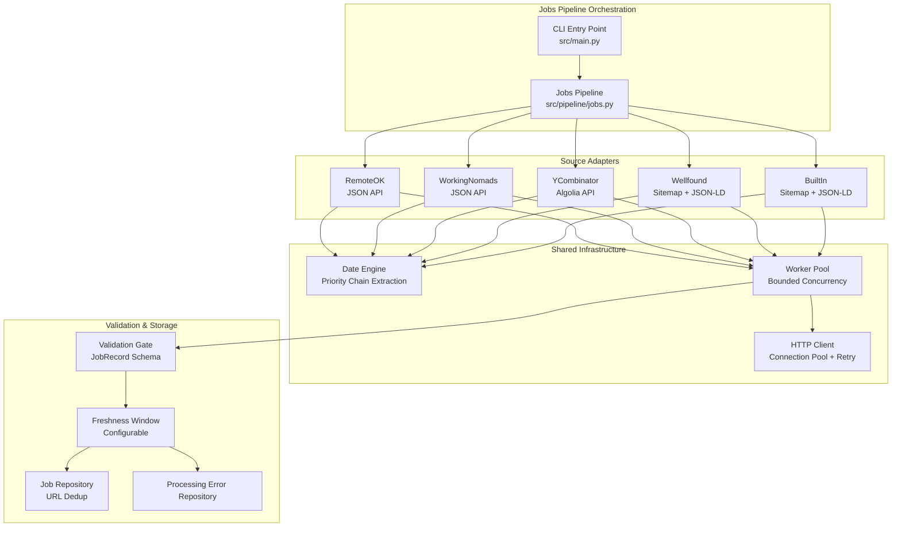

# Design Document: Phase 7 - Jobs Ingestion

## Overview

### Purpose
The Jobs vertical extends the GraphOne Intelligence Pipeline to ingest AI-related job postings from five distinct sources. It reuses the Phase 1-6 infrastructure (HTTP_Client, Worker_Pool, Date_Engine, Pipeline Orchestration) to fetch, extract, validate, and persist JobRecords.

### Key Design Principles
1. **Reuse Over Reinvention**: Utilize existing Phase 6 news orchestration patterns where possible.
2. **Database-Level Deduplication**: Enforce uniqueness via the existing `(source_name, url)` constraint on the `jobs` table.
3. **No LLM Fabrication**: Missing required fields (`title`, `company`, `url`, `posted_at`) result in record rejection. No LLM heuristics are allowed for extracting missing core fields.

## Architecture

### High-Level System Architecture


### Component Integration

1. **HTTP Client Reuse**: `AsyncHttpClient` is used for all network fetches. Rate limits and block rules from Phase 6 apply identical logic here.
2. **Date Engine**: `Date_Engine` normalizes date structures from APIs and JSON-LD schemas to UTC.
3. **Worker Pool**: `Worker_Pool` orchestrates concurrent fetches per adapter, using `max_concurrency` just like Phase 6.

### Data Models & Schemas

**JobRecord Schema (Pydantic)**
```python
class JobRecord(BaseModel):
    schema_version: str = "1.0"
    record_type: str = "JOB"
    title: str = Field(min_length=1)
    company: str = Field(min_length=1)
    url: str
    source_name: str = Field(min_length=1)
    posted_at: datetime
    is_remote: bool | None = None
    role_family: str | None = None
    raw_document_id: uuid.UUID | None = None
    metadata_json: dict = Field(default_factory=dict)
```
*Note*: `raw_document_id` will be explicitly added to the `Job` SQLAlchemy model as a foreign key to `raw_documents.id` to support Section 8 provenance linkage. The pipeline orchestration will insert the fetched payload into `RawDocumentRepository` first, capture the returned ID, and attach it to the `JobRecord` before persisting it to the `JobRepository`.

## Source Adapters Design

1. **RemoteOKAIAdapter**:
   - Queries `https://remoteok.com/api`.
   - Iterates over JSON items. Maps `position`->`title`, `company`->`company`, `url`->`url`, `date`->`posted_at`. Sets `is_remote=True`.

2. **WorkingNomadsAIAdapter**:
   - Queries `https://www.workingnomads.com/api/exposed_jobs`.
   - Maps `title`, `company_name`, `url`, `pub_date`. Sets `is_remote=True`.

3. **YCombinatorWhoIsHiringAdapter**:
   - Queries `https://hn.algolia.com/api/v1` for "Ask HN: Who is hiring?".
   - Fetches children (comments). Applies regex/split on the first line to infer `company` and `title`. Uses `created_at` for `posted_at`.

4. **WellfoundAIAdapter & BuiltInAIAdapter**:
   - Uses `SITEMAP` discovery.
   - Fetches XML, parses `<loc>` URLs, then queries HTML pages.
   - Extracts the `JobPosting` schema embedded in `<script type="application/ld+json">`.
   - Maps `title`, `hiringOrganization.name`->`company`, `url`, `datePosted`.

## Storage & Deduplication Strategy
1. **Deduplication**: Handled entirely at the database level by `JobRepository.upsert_job()`, via `ON CONFLICT (source_name, url) DO NOTHING`.
2. **Freshness Strategy**: `is_fresh()` checks the `posted_at` against the `reference_time`. Stale jobs are rejected and logged to `ProcessingErrorRepository`.

## Testing Strategy
1. **No Live External Services**: All adapter tests use mocked `httpx` or `respx` routers.
2. **Fixtures**: JSON responses for RemoteOK/WorkingNomads/Algolia. XML Sitemaps + JSON-LD HTML for Wellfound/BuiltIn.
